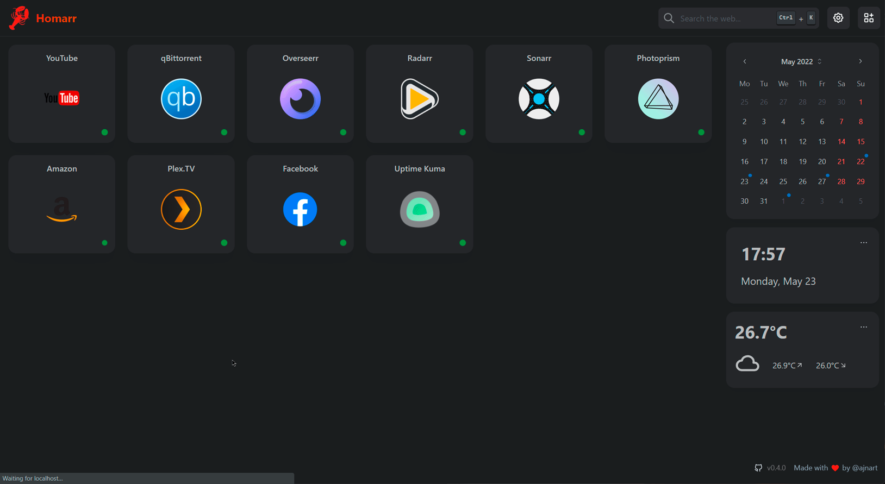

<!--
NOTA: Este README foi creado automáticamente por <https://github.com/YunoHost/apps/tree/master/tools/readme_generator>
NON debe editarse manualmente.
-->

# Homarr para YunoHost

[](https://dash.yunohost.org/appci/app/homarr)  

[](https://install-app.yunohost.org/?app=homarr)

*[Le este README en outros idiomas.](./ALL_README.md)*

> *Este paquete permíteche instalar Homarr de xeito rápido e doado nun servidor YunoHost.*  
> *Se non usas YunoHost, le a [documentación](https://yunohost.org/install) para saber como instalalo.*

## Vista xeral

Homarr is a simple and lightweight homepage for your server, that helps you easily access all of your services in one place.
It integrates with the services you use to display information on the homepage (E.g. Show upcoming Sonarr/Radarr releases).

### Features

- Integrates with services you use.
- Search the web directly from your homepage.
- Real-time status indicator for every service.
- Automatically finds icons while you type the name of a service.
- Widgets that can display all types of information.
- Very light-weight and fast.


**Versión proporcionada:** 0.15.3~ynh2

**Demo:** <https://homarr.ajnart.fr/fr>

## Capturas de pantalla



## Documentación e recursos

- Web oficial da app: <https://homarr.dev/>
- Documentación oficial para usuarias: <https://homarr.dev/docs/about>
- Documentación oficial para admin: <https://homarr.dev/docs/about>
- Repositorio de orixe do código: <https://github.com/ajnart/homarr>
- Tenda YunoHost: <https://apps.yunohost.org/app/homarr>
- Informar dun problema: <https://github.com/YunoHost-Apps/homarr_ynh/issues>

## Info de desenvolvemento

Envía a túa colaboración á [rama `testing`](https://github.com/YunoHost-Apps/homarr_ynh/tree/testing).

Para probar a rama `testing`, procede deste xeito:

```bash
sudo yunohost app install https://github.com/YunoHost-Apps/homarr_ynh/tree/testing --debug
ou
sudo yunohost app upgrade homarr -u https://github.com/YunoHost-Apps/homarr_ynh/tree/testing --debug
```

**Máis info sobre o empaquetado da app:** <https://yunohost.org/packaging_apps>
